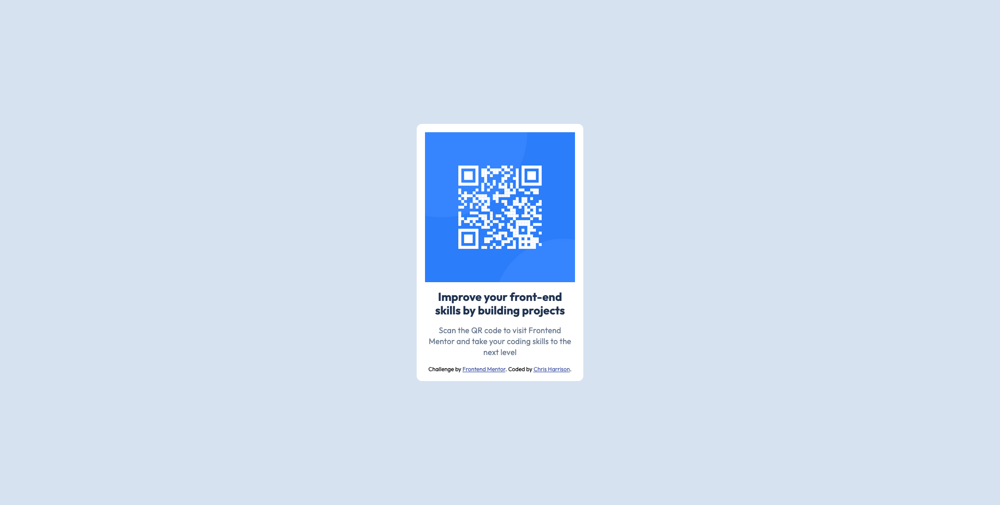

# Frontend Mentor - QR code component solution

This is a solution to the [QR code component challenge on Frontend Mentor](https://www.frontendmentor.io/challenges/qr-code-component-iux_sIO_H). Frontend Mentor challenges help you improve your coding skills by building realistic projects.

## Table of contents

- [Frontend Mentor - QR code component solution](#frontend-mentor---qr-code-component-solution)
  - [Table of contents](#table-of-contents)
  - [Overview](#overview)
    - [Screenshot](#screenshot)
    - [Links](#links)
    - [Built with](#built-with)
    - [What I learned](#what-i-learned)
    - [Continued development](#continued-development)
    - [Useful resources](#useful-resources)
  - [Author](#author)

**Note: Delete this note and update the table of contents based on what sections you keep.**

## Overview

### Screenshot

### Links

- Solution URL: [Add solution URL here](https://your-solution-url.com)
- Live Site URL: [Add live site URL here](https://your-live-site-url.com)

### Built with

- Semantic HTML5 markup
- CSS custom properties
- Flexbox
- Mobile-first workflow

### What I learned

I have been primarily working on back-end hardware facing development using C# and other technologies in my day job for the past two years, so I'm a bit rusty on my fullstack skills, especially my Front-End CSS development. I plan on using Front End Mentor as a way to sharpen my skills back up to the level they were at around two years ago. I used this challenge as a way to work on mobile-first development. Funnily enough, I encountered the same problem I always used to have, how to center the content in the middle of the page!
Please let me know about anything you think that could be improved, I'm here to get better, so your feedback is welcome!

### Continued development

I'd like ton continue working on Flexbox, and CSS grid in the future. I used to use these technologies a lot, but I haven't recently, so I'd like to get back up to speed.

### Useful resources

- [Web.Dev](https://web.dev/learn/css/welcome) - I used Web.Dev's CSS course as a quick refresher on my foundational CSS skills.

## Author

- Website - [Chris Harrison](https://www.charrison.dev)
- Frontend Mentor - [@CKHarrison](https://www.frontendmentor.io/profile/CKHarrison)
- GitHub - [@CKHarrison](https://github.com/CKHarrison)
